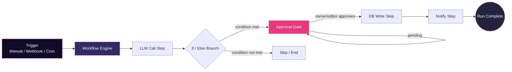

<!-- ============== HERO ============== -->
<p align="center">
  
</p>

<p align="center">
  
</p>

<p align="center">
  <a href="https://aetherflow-fawn.vercel.app"></a>
  <a href="https://github.com/chittoralovesh/Aetherflow/issues"></a>
  <a href="#-local-setup"></a>
</p>

<p align="center">
  
  
  
  
</p>


## ⚡ What is AetherFlow?

AetherFlow is a lightweight, **n8n-style visual workflow orchestrator** purpose-built for chaining AI agent steps. Drag together LLM calls, conditional branches, human approval gates, and database writes — then watch each step execute live, streamed straight to the dashboard.

Under the hood it enforces **two layers of access control** (row-level org scoping + step-level action gating), so multi-tenant teams can collaborate on the same workflow engine without leaking data across organizations.

<table align="center">
<tr>
<td align="center" width="25%">🔗<br/><b>Visual Builder</b><br/><sub>Chain LLM, branch, gate & DB steps</sub></td>
<td align="center" width="25%">🛰️<br/><b>Live Streaming</b><br/><sub>SSE-powered real-time run monitor</sub></td>
<td align="center" width="25%">🔒<br/><b>Multi-Tenant RLS</b><br/><sub>Airtight cross-org isolation</sub></td>
<td align="center" width="25%">✋<br/><b>Approval Gates</b><br/><sub>Stateful pause & resume</sub></td>
</tr>
</table>


## 🧱 Tech Stack

<div align="center">

| Layer | Tech |
|---|---|
| Frontend & API Router |  |
| Database |  |
| API Protocol |  |
| Live Transport |  |
| Deployment |   |

</div>


## 🏗️ How a Run Flows




## 🔐 Security Architecture

AetherFlow enforces access control at **two independent layers**, so even a compromised UUID or a misconfigured client can't cross org boundaries.

### Layer 1 — Row Level Scoping

Every database transaction is scoped to the caller's organization membership. Guessing another org's workflow UUID gets rejected outright — there's no partial data leak.

<div align="center">

| Role | Workflows / Triggers / Steps | Runs | Team Management |
|---|:---:|:---:|:---:|
| **Viewer** | Read-only | Read-only | ❌ |
| **Editor** | Full CRUD | Can trigger | ❌ |
| **Owner** | Full CRUD | Full CRUD | ✅ Invite & manage roles |

</div>

### Layer 2 — Step-Level Gating

Certain step types carry tighter, programmatically-enforced restrictions in the action handlers themselves:

<div align="center">

| Step Type | Restriction |
|---|---|
| `db_write` | Requires **Owner** role |
| `notify` (webhook alerts) | Requires **Owner** role |
| `approveStepRun` (resume from Approval Gate) | Requires **Owner** or **Editor** role |

</div>


## 🚀 Local Setup

<details open>
<summary><b>1. Database Setup</b></summary>

<br/>

Ensure PostgreSQL is running locally on port `5432`, then create the database and apply the schema:

```bash
# Create database
psql -U postgres -c "CREATE DATABASE workflow_builder;"

# Apply schema & seed identities
psql -U postgres -d workflow_builder -f schema.sql
```

</details>

<details>
<summary><b>2. Install Dependencies</b></summary>

<br/>

```bash
npm install
```

</details>

<details>
<summary><b>3. Run the Dev Server</b></summary>

<br/>

```bash
npm run dev
```

Then open **http://localhost:3000** in your browser.

</details>


## ✅ Verifying the Full Scenario

<details open>
<summary><b>Automated integration test</b></summary>

<br/>

Verifies the full engine execution flow — permission scopes, approval pause/resume, and usage quota updates — in one shot:

```bash
npx ts-node -O '{"module": "commonjs", "moduleResolution": "node"}' test_workflow.ts
```

</details>

<details>
<summary><b>Manual walkthrough via the dashboard</b></summary>

<br/>

1. **Login Selector** — pick **Org A Owner** from the top-right dropdown.
2. **Build & Save** — create a workflow with an **LLM Call**, **If/Else Branch**, **Approval Gate**, and **DB Write** step, then Save.
3. **Trigger** — click **Trigger Manual Run**; the run panel opens on the right.
4. **Watch it stream** — steps execute live, evaluate the condition, then pause statefully at the **Approval Gate**.
5. **Permission check (blocked)** — switch to **Org A Viewer** or **Org B User** and try "Approve & Resume." It's rejected.
6. **Permission check (allowed)** — switch back to **Org A Owner/Editor**, click "Approve & Resume." Execution resumes, writes to Postgres, and the org's quota increments.
7. **Webhook trigger** — copy the `curl` command from the trigger panel and fire it from a terminal to trigger externally.
8. **Cron trigger** — click "Run Cron Trigger" to fire any workflow with a scheduled trigger attached.

</details>


## 🌐 Links

<div align="center">

[](https://aetherflow-fawn.vercel.app)
[](https://github.com/chittoralovesh/Aetherflow)
[](https://linkedin.com/in/loveshchittora)

</div>

<p align="center">
  
</p>
